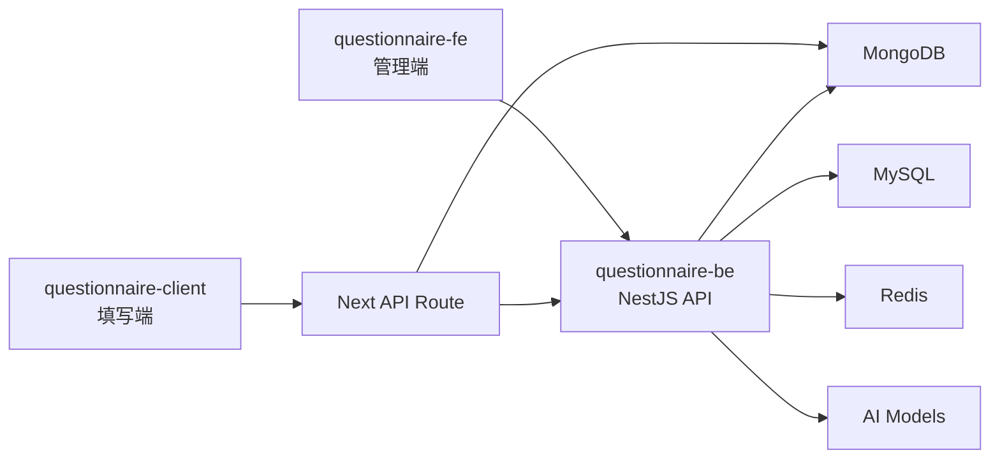

# 问卷小筑（AIForm）


<div align="center">
  
  
  
  
  
  
  
  
  
  
</div>

一个基于 `pnpm workspace + Lerna` 的问卷平台 monorepo，包含：

- `questionnaire-fe`：问卷管理端 / 编辑器 / 数据统计后台
- `questionnaire-client`：问卷填写端 / 对外访问页面
- `questionnaire-be`：统一业务后端 / AI 服务 / 问卷与答案能力

项目目标不是单纯做一个“表单页面”，而是覆盖问卷从创建、发布、填写、统计到 AI 辅助生成与分析的完整链路。

## 项目亮点

- 拖拽式问卷编辑器，支持组件增删、排序、属性配置、实时预览
- 完整问卷生命周期管理：创建、收藏、发布、下线、回收站、彻底删除
- 管理端统计分析能力，支持图表化展示答卷结果
- AI 能力已接入后端，支持问卷生成、AI 分析、Copilot 会话流式返回
- 管理端与填写端分离，适合后台运营和对外投放两种场景
- 支持本地开发与 Docker 部署两套运行方式

## 功能概览

### 管理端 `packages/questionnaire-fe`

- 用户登录、注册、个人中心
- 问卷列表、收藏列表、回收站
- 问卷编辑器、AI问卷助手
- 二维码页面
- 问卷详情页
- 数据统计页
- AI 分析页

### 填写端 `packages/questionnaire-client`

- 问卷首页展示
- 问卷作答流程
- 提交成功页
- 通过 Next.js API Route 读取问卷详情、写入答卷数据

### 后端 `packages/questionnaire-be`

- 认证鉴权
- 问卷 CRUD 与发布管理
- 编辑器存储
- 答卷统计处理
- 文件服务
- 邮件服务
- AI 模型接入与 SSE 流式返回
- 定时任务

### 当前支持的题型

- 标题
- 段落说明
- 简答题
- 单选题
- 多选题
- 下拉选择
- 日期选择
- 评分题
- NPS 评分
- 矩阵单选
- 矩阵多选
- 滑块题

## 技术栈

| 层级 | 技术 |
| --- | --- |
| 管理端 | React 18、Vite 5、Redux Toolkit、React Router、Ant Design、Tailwind CSS |
| 填写端 | Next.js 15、React 18、HeroUI、Tailwind CSS、Zustand |
| 后端 | NestJS 10、TypeORM、Mongoose、JWT、Mailer、Schedule |
| 数据层 | MySQL、MongoDB、Redis |
| AI | OpenAI SDK 兼容接入，多模型配置能力 |
| 工程化 | pnpm workspace、Lerna、Husky、Commitlint、ESLint、Prettier、Jest |

## 架构关系



补充说明：

- MySQL 主要承载用户、问卷基础信息、会话等结构化数据
- MongoDB 主要承载问卷详情与答卷内容
- Redis 作为运行期依赖服务接入
- 填写端并不是纯静态页，而是通过 Next.js API Route 直接读写 Mongo，并与后端联动更新问卷答题数

## 目录结构

```text
myQuestionnaire
├─ packages
│  ├─ questionnaire-fe        # 管理端 / 编辑器 / 统计后台
│  ├─ questionnaire-client    # 问卷填写端
│  └─ questionnaire-be        # NestJS 后端
├─ docker                     # Docker 相关配置
├─ scripts                    # 发版、镜像脚本
├─ docker-compose.yml         # 本地容器编排
├─ pnpm-workspace.yaml
└─ lerna.json
```

## 快速开始

### 1. 环境准备

推荐环境：

- Node.js `20+`
- pnpm `10+`
- Docker / Docker Compose

安装依赖：

```bash
pnpm install
```

### 2. 初始化本地配置

首次拉取代码后，先复制模板文件：

```bash
cp .env.example .env
cp packages/questionnaire-fe/.env.example packages/questionnaire-fe/.env.local
cp packages/questionnaire-client/.env.example packages/questionnaire-client/.env.local
cp packages/questionnaire-be/src/config/dev.example.yml packages/questionnaire-be/src/config/dev.local.yml
```

Windows PowerShell 可使用：

```powershell
Copy-Item .env.example .env
Copy-Item packages/questionnaire-fe/.env.example packages/questionnaire-fe/.env.local
Copy-Item packages/questionnaire-client/.env.example packages/questionnaire-client/.env.local
Copy-Item packages/questionnaire-be/src/config/dev.example.yml packages/questionnaire-be/src/config/dev.local.yml
```

然后按需填写以下关键字段：

- `.env`：镜像仓库、Docker 端口、数据库密码、邮件配置、AI Key
- `packages/questionnaire-fe/.env.local`：管理端端口、代理地址、填写端地址
- `packages/questionnaire-client/.env.local`：填写端端口、Mongo 配置、后端 API 地址、内部调用密钥
- `packages/questionnaire-be/src/config/dev.local.yml`：后端本地数据库、JWT、邮件、AI 模型配置

更完整的配置说明见 [docs/configuration.md](./docs/configuration.md)。

AI Key 推荐配置在后端 `dev.local.yml` 或根目录 `.env` 中。若使用魔搭社区 API Inference，可参考官方文档：
[API推理介绍 · 文档中心](https://www.modelscope.cn/docs/model-service/API-Inference/intro)

如果在 macOS 或 Linux 上使用 Husky，首次需要补权限：

```bash
chmod +x .husky/*
```

### 3. 准备依赖服务

本项目开发依赖：

- MySQL
- MongoDB
- Redis

最简单的方式是直接启动仓库里的容器：

```bash
docker-compose up -d mysql mongo redis
```

如果想一次性把三端都跑起来，也可以直接：

```bash
docker-compose up --build
```

### 4. 初始化数据库

MySQL 可使用以下 SQL 文件初始化：

```text
packages/questionnaire-be/db/questionnaire_db.sql
```

MongoDB 如需插入默认问卷数据，可手动执行：

```bash
node packages/questionnaire-client/scripts/init-db.ts
```

如果本地 Node 不能直接执行 `.ts`，请改为使用自己的 TypeScript 执行方式，或者参考脚本内容手动插入数据。

### 5. 启动各应用

分别在根目录执行：

```bash
pnpm dev:be
pnpm dev:fe
pnpm dev:client
```

默认访问地址：

- 管理端：http://localhost:8877
- 填写端：http://localhost:8878
- 后端：http://localhost:8879/api

## 配置说明

### 后端配置

后端配置文件位于：

- `packages/questionnaire-be/src/config/dev.example.yml`
- `packages/questionnaire-be/src/config/docker.example.yml`

本地开发时，后端还支持额外的本地覆盖配置：

- `packages/questionnaire-be/src/config/dev.local.yml`
- `packages/questionnaire-be/src/config/docker.local.yml`

配置优先级：

- 本地文件 `*.local.*`
- 仓库内安全模板 `*.example.*`
- Docker / CI 注入的环境变量会继续覆盖对应字段

建议把个人机器上的账号、密码、API Key 都放到 `*.local.*` 文件，不要直接改模板文件。

### 管理端配置

管理端主要使用 Vite 环境变量，开发时建议复制 `packages/questionnaire-fe/.env.example` 为 `.env.local`：

- `VITE_DEV_PORT`：本地开发端口，默认 `8877`
- `VITE_API_PROXY_TARGET`：接口代理地址，默认 `http://localhost:8879`
- `VITE_CLIENT_URL`：填写端地址，生产环境用于跳转或链接拼接

### 填写端配置

填写端建议复制 `packages/questionnaire-client/.env.example` 为 `.env.local`，支持以下字段：

- `CLIENT_PORT` 或 `PORT`：填写端端口，默认 `8878`
- `BACKEND_API_BASE_URL`：Next API Route 回调后端时使用
- `INTERNAL_API_SECRET`：填写端服务端调用后端内部接口时使用
- `MONGO_HOST`：Docker / 生产场景下的 Mongo 主机

### 根目录 `.env`

根目录 `.env` 不再提交到仓库。请从 `.env.example` 复制生成，用于：

- Docker Compose 参数替换
- 镜像构建与推送脚本
- 本地共享的数据库 / 邮件 / AI 配置

不能提交的典型文件：

- `.env`
- `.env.local`
- `packages/questionnaire-fe/.env.local`
- `packages/questionnaire-client/.env.local`
- `packages/questionnaire-be/src/config/dev.local.yml`
- `packages/questionnaire-be/src/config/docker.local.yml`

## 常用脚本

根目录脚本：

```bash
pnpm dev:fe        # 启动管理端
pnpm dev:client    # 启动填写端
pnpm dev:be        # 启动后端
pnpm lint          # 校验前后端代码
pnpm format        # 格式化前后端代码
pnpm release       # lerna 版本发布
pnpm postversion   # 发布后打 tag
pnpm stat          # 统计代码量
pnpm build:docker-compose:dev
```

子应用常用脚本：

```bash
pnpm -F @questionnaire/fe build
pnpm -F @questionnaire/client build
pnpm -F @questionnaire/be build
pnpm -F @questionnaire/be test
```

## Docker 部署

仓库根目录已经提供 `docker-compose.yml`，默认端口如下：

- `8877` -> 管理端
- `8878` -> 填写端
- `8879` -> 后端
- `33306` -> MySQL 宿主机端口，对应容器内 `3307`
- `27017` -> MongoDB
- `6379` -> Redis

直接启动：

```bash
docker-compose up --build -d
```

如果要部署到服务器，至少需要检查并替换以下配置：

- 数据库账号密码
- 邮箱服务账号
- JWT 密钥
- AI 模型密钥
- 内部调用密钥
- 镜像仓库地址

## 开发建议

- 这是一个标准 monorepo，改动前先确认自己修改的是管理端、填写端还是后端
- 业务配置中已有开发环境与 Docker 环境区分，新增配置建议沿用这一模式
- AI、邮件、数据库、镜像仓库等敏感信息不要直接提交到仓库，统一放在本地配置文件或 CI Secret
- 填写端与后端都依赖 Mongo 数据结构，改题型或字段时要同步检查两边适配逻辑
- 初始化 SQL 不包含真实用户和生产数据

## License

[MIT](./LICENSE)
